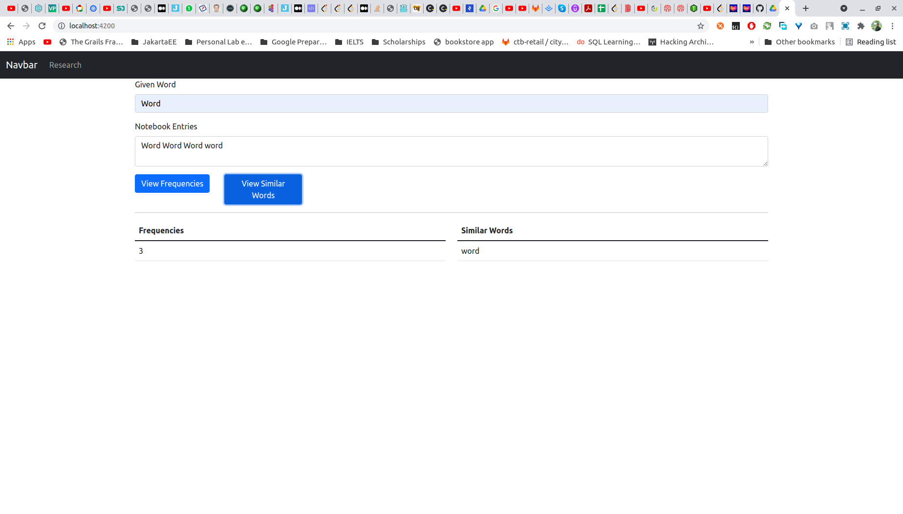

## Idea to satisfy the specification
 
- The Notebook entry and word will be 2 String inputs
- Check all length mismatching words (|string1 - string2| > 2 ?) for faster processing
- Check each words of input with Levenshtein Distance algorithm and insert in a map for similar word entries
- Count the exact matching words as the frequencies
- The Request Object (DTO) will contain 2 Strings - givenWord, notebookEntry
- The REST API endpoint will be:
  - `/research/frequency` Response Object: `{
    "frequency": 1
    }`
  - `/research/similar-words` Response Object: `{
    "similarWords": [
    "Words",
    "Wor",
    "word"
    ]
    }`

## How to Run

To run in development mode, from the root directory of the project, run
```
 $ mvn clean package
```

This will create runnable jar of the backend. now navigate to the /backend/target dir and run:

```
 $ java -jar labforward-backend-${version}.jar
```

Now, to run the frontend application, navigate to the /frontend folder and run the following command.

```
 $ ng serve
```

It will run your application in `http://localhost:4200`. The page will be like below.



## Further improvements

- For simplicity, a text file of the notebook entries upload is not provided for now. But can be implemented if time permits.
- Support for multiple entries in a single request
- Improve the UI
